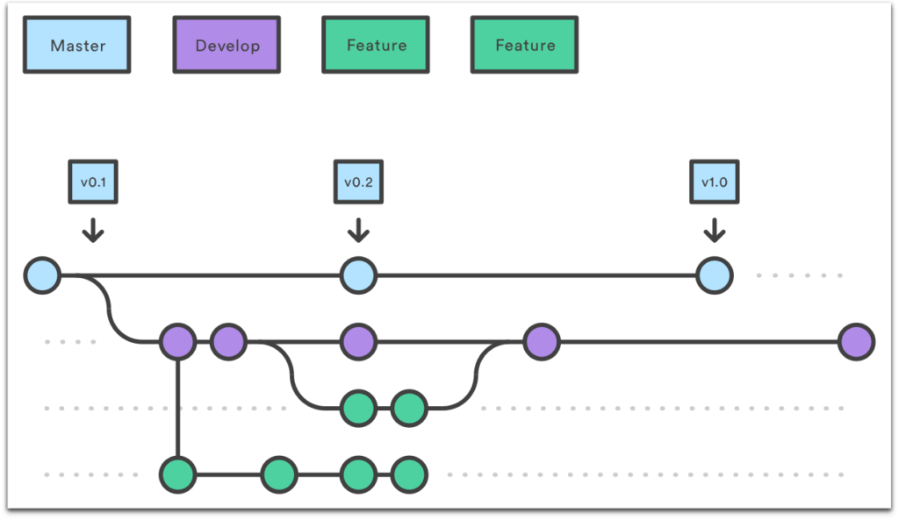

<h1 align="center">
Readme Under Construction 🚧 
</h1>

## Author

👤 **Juan Pablo**

- Website:
- Twitter: []()
- GitHub: []()
- LinkedIn: []()

👤 **Emmanoel Coutinho**

- Website:
- Twitter: []()
- GitHub: []()
- LinkedIn: []()

### Getting Started 🚀

#### Cloning

```ps
# Clone the repository using git
$ git clone https://github.com/JuanPabllo/basic-commerce.git

# Access the project folder
$ cd basic-commerce
```

#### Requirements

- [Node.js](https://nodejs.org/en/)
- [Yarn](https://yarnpkg.com/) or [npm](https://www.npmjs.com/)

This project use third party dependencies that need to be installed, use that command to install all needed dependencies

```ps
$ yarn install
or
$ npm i
```

#### Running

To start the Server run the command

```ps
# Entering in directory
$ cd basic-commerce

# Run the server
$ yarn dev
or
$ npm run dev
```

# Roadmap

- [x] [Test](https://github.com/JuanPabllo/basic-commerce)

# For Devs

<div align="center">



</div>
